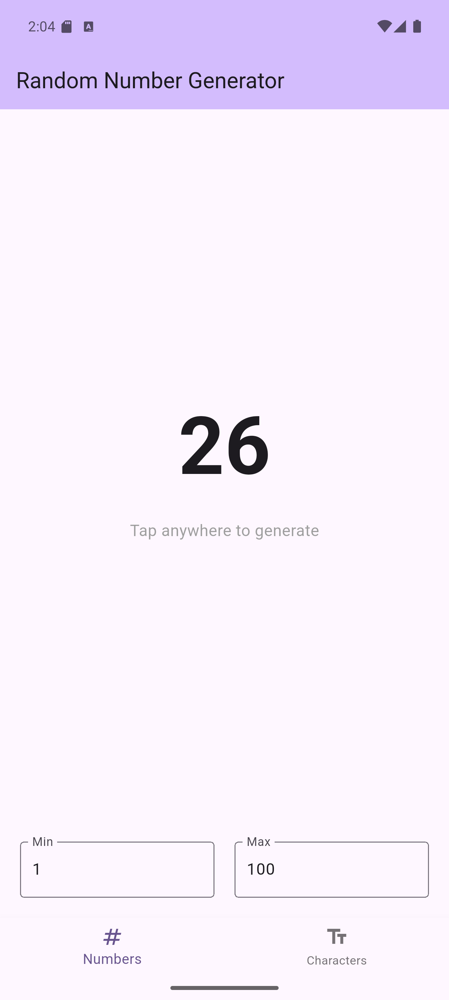
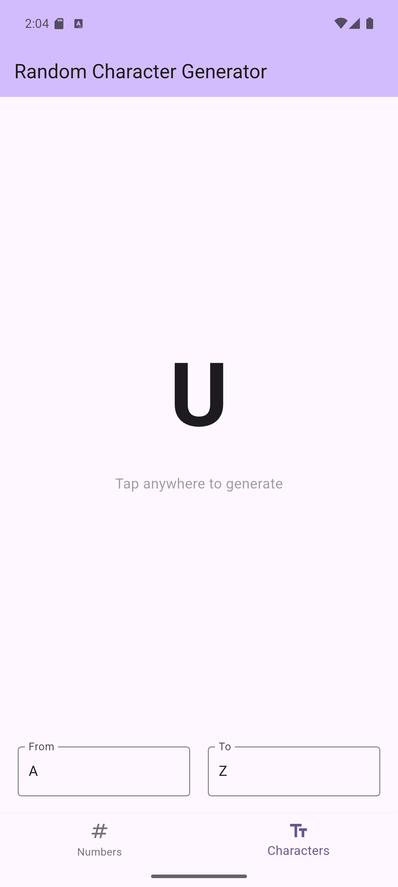
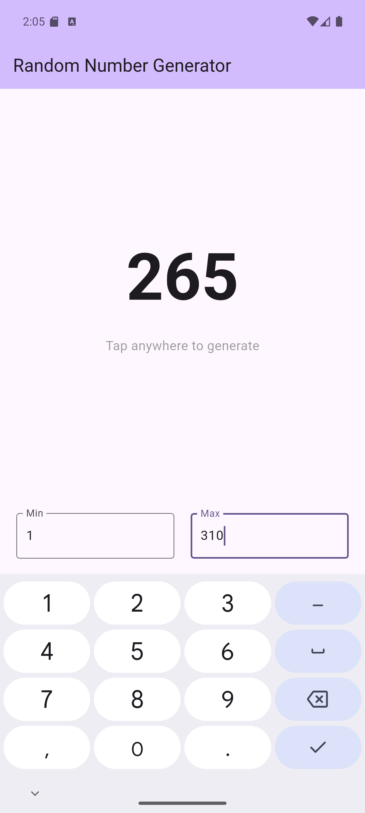

# Randly

A Flutter application that provides tools for generating random characters and numbers with animated transitions.

## Features

### Random Character Generator
- Generate random characters within a specified range
- Smooth animations between character transitions
- Customizable range (from A to Z by default)
- Simple tap interface for generating new characters

### Random Number Generator
- Generate random numbers within a specified range
- Animated transitions between numbers
- Customizable minimum and maximum values (1 to 100 by default)
- User-friendly interface with tap-to-generate functionality

## Screenshots
<div align="center" style="display: flex; flex-direction: row; justify-content: center; gap: 10px;">
   
   
   
</div>

## Getting Startedbn

### Prerequisites
- Flutter SDK (latest stable version recommended)
- Android Studio / VS Code with Flutter plugins
- An emulator or physical device for testing

### Installation

1. Clone the repository:
   ```
   git clone https://github.com/lemmouchimds/randly.git
   ```

2. Navigate to the project directory:
   ```
   cd randly
   ```

3. Install dependencies:
   ```
   flutter pub get
   ```

4. Run the app:
   ```
   flutter run
   ```

## Usage

1. Open the app and choose between the random character or random number generator
2. Set your desired range using the input fields at the bottom
3. Tap anywhere on the screen to generate a new random value
4. Watch the smooth animation as the value transitions

## Technical Details

The app uses Flutter's animation system to create smooth transitions between generated values. Both generators feature:
- Custom animation controllers
- Non-linear animation curves for a more natural feel
- Range validation to ensure proper functionality
- State management for smooth UI updates

## Contributing

Contributions are welcome! Please feel free to submit a Pull Request.

## License

This project is licensed under the MIT License - see the LICENSE file for details.
